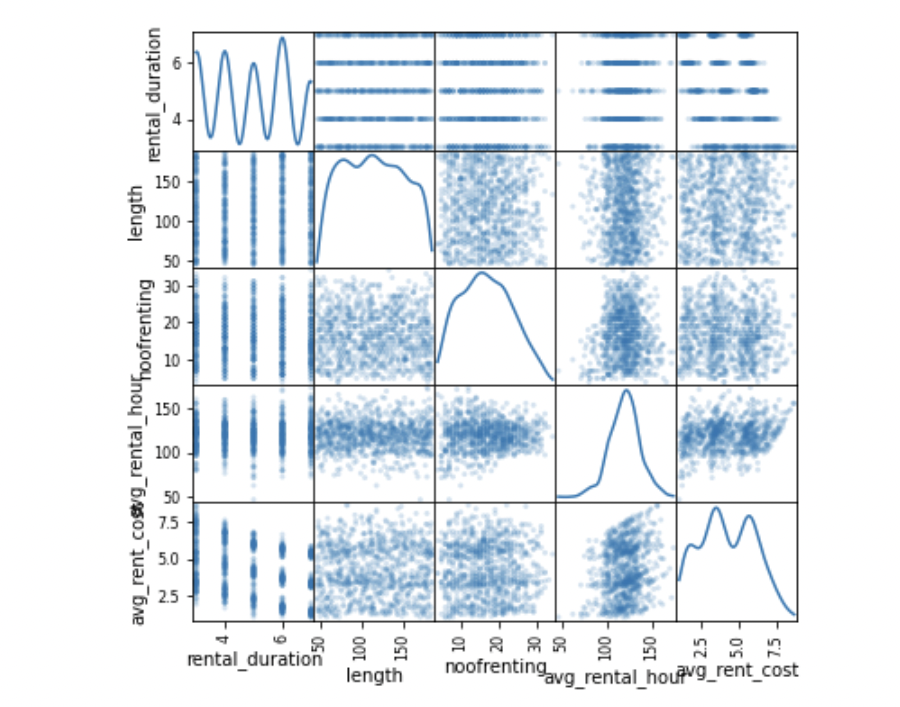
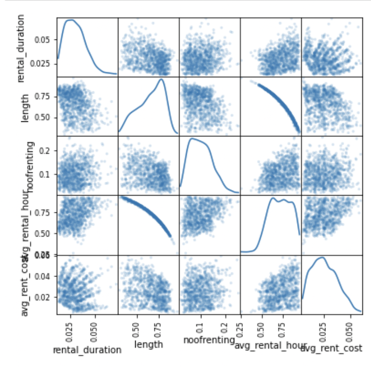
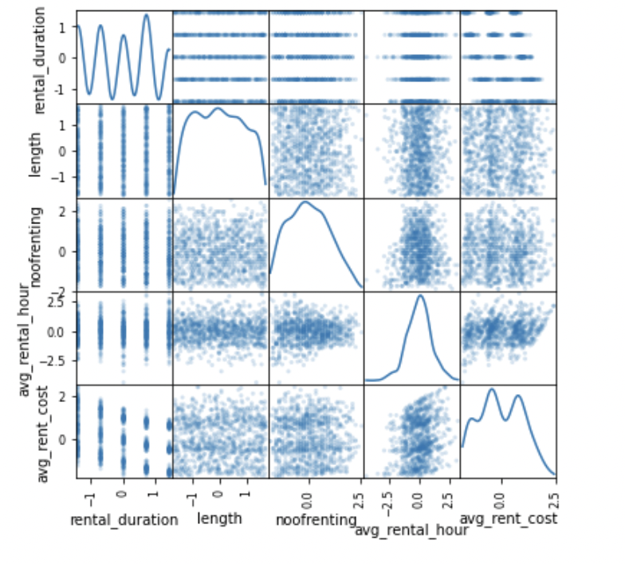

# Binary classification with Logistic regression
by Ümmühan Demir November 2021

#### **We want to be able to predict which films will be rented next month using Sakila database.** :popcorn: :clapper: :movie_camera:

### Table of Contents  
[Data Question & Methodology](#Headers)  
[Next Steps](#Headers)
[Useful Links](#Headers)
<a name="headers"/>
## Data Question & Methodology
This week we are working on the Sakila database mainly to answer the question: which films will be rented next month? The answer of this question would be binary, either 1(yes, it will be rented) or 0(no, sorry out of trends). To get that end logistic regression will be used. 
 My methodology to approach this question is as following:
* First, I tried to query the most relevant data out of Sakila on **MySql workbench**. 
* Next, to work on that data I connect **Python** and **Sql** by using **pymysql** and **sqlalchemy** libraries and run the query I ended up with.
* After creating dataframe, to gain deeper insight into it I did some explorations, and plottings of correlation matrix. The last one is particularly important for us as it is a signal of multicollinearity.
* I applied some preprocessing on numerical columns to make them a bit more 'normal'.
 

  
   
  

## Next Steps

## Useful Links & Notes
* I added the sakila-db for whom want to dive into it.
* This [link](https://github.com/UmmuDem/Making_Predictions_Sakila/blob/main/related_lab_questions.md) can be used to see the lab questions as a guideline for our purpose.
* [This](https://github.com/UmmuDem/Making_Predictions_Sakila/blob/main/Lab%20%7C%20Making%20predictions%20with%20logistic%20regression.ipynb) is the my jupyter notebook for detailed explanations and the code itself.

